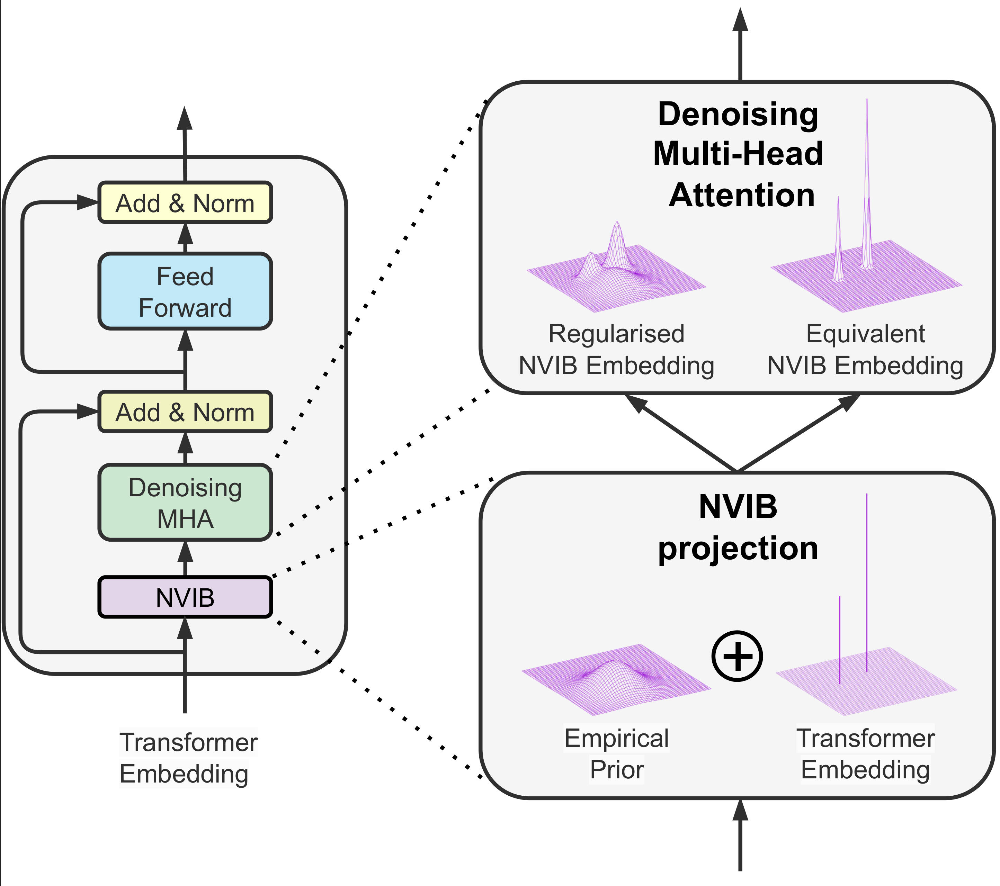
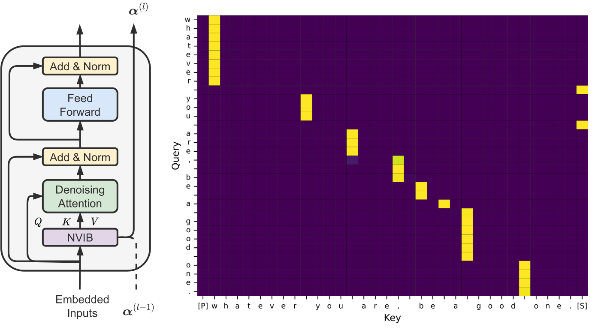

I am a final year PhD candidate of the EDEE department at [EPFL](https://www.epfl.ch/en/), and research assistant at [Idiap Research Institute](https://www.idiap.ch/en), in the [Natural Language Understanding](https://www.idiap.ch/en/scientific-research/natural-language-understanding) group under the supervision of [Dr. James Henderson](https://www.idiap.ch/~jhenderson/). My current research involves understanding deep attention-based models and their connection with Bayesian nonparametrics for Natural Language Processing. I received both undergraduate (2018) and masters (2020) qualifications from [University of Cape Town](https://www.uct.ac.za/) with specializations in statistics. 

## News

**[December 2023]**

Our work on Learning to Abstract with Nonparametric Variational Information Bottleneck will be presented at the [**Black Box NLP Workshop**](https://blackboxnlp.github.io/) EMNLP in Singapore!

**[December 2023]**

|  | Our paper [**Nonparametric Variational Regularisation of Pretrained Transformers**](https://arxiv.org/pdf/2312.00662.pdf) is on ArXiv. |

**[October 2023]**

|  | Our short paper [**Learning to Abstract with Nonparametric Variational Information Bottleneck**](https://openreview.net/pdf?id=vU0KbvQ91x) is accepted to findings of EMNLP 2023 in Singapore, ([Paper](https://openreview.net/pdf?id=vU0KbvQ91x)) ([Demo](https://huggingface.co/spaces/FJFehr/NVIB-Self-Attention-Demo)) ([Poster](https://FJFehr.github.io/files/NVIB_SA_poster.pdf)) ([Code](https://github.com/idiap/nvib_selfattention)) |

**[Autumn Semester 2023]**

Teaching for [**Deep Learning for Natural Language Processing**](https://edu.epfl.ch/coursebook/en/deep-learning-for-natural-language-processing-EE-608) at EPFL. 

**[August 2023]**

Interviewed by the Bayes Newsletter of the South African Statistical Association (SASA) - [**The Journey from Undergraduate to PhD**](https://FJFehr.github.io/files/interview.pdf)

**[July 2023]**

Joined the company [**Defiant**](https://www.defiant.com/) for a week in Banff, Canada as an AI consultant.  

**[June 2023]**

Attending the [**Generative Modeling Summer School**](https://gemss.ai/) GeMSS 2023 in Copenhagen, Denmark.  

**[May 2023]**

Attending the 2023 ICLR conference in Kigali, Rwanda

**[April 2023]**

|  | Our paper [**HyperMixer: An MLP-based Low Cost Alternative to Transformers**](https://arxiv.org/abs/2203.03691) is accepted to ACL 2023, ([Paper](https://arxiv.org/pdf/2203.03691.pdf)) ([Poster](https://FJFehr.github.io/files/Hypermixer_Poster.pdf)) ([Code](https://github.com/idiap/hypermixing))|

**[January 2023]**

|  | Our paper [A Variational AutoEncoder for Transformers with Nonparametric Variational Information Bottleneck](https://openreview.net/forum?id=6QkjC_cs03X) is accepted to ICLR 2023. ([Paper](https://openreview.net/forum?id=6QkjC_cs03X)) ([Code](https://github.com/idiap/nvib))  |

 
<a href="{{ site.url }}/updates"> See more... </a>
