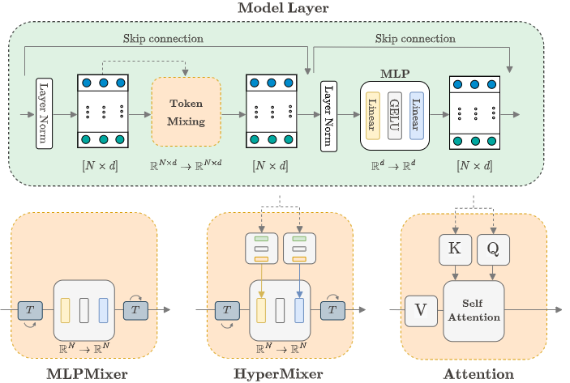
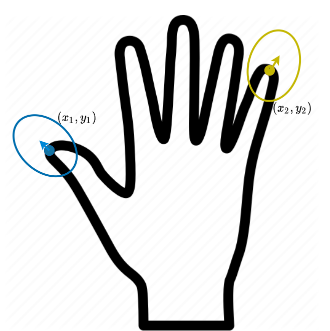
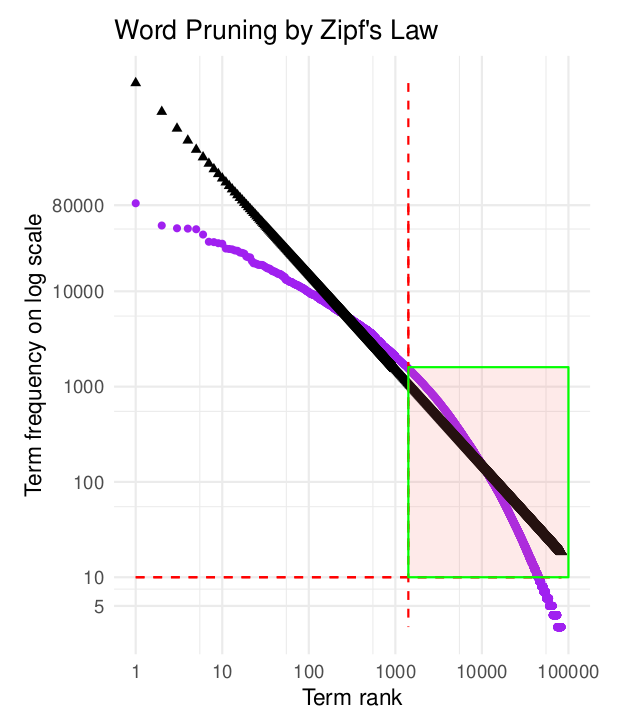

My research interests are in the connections between human cognition and deep learning. Specifically, attention-based representation learning, Bayesian nonparametrics and their applications to text generation tasks. You can find my papers on [Google Scholar](https://scholar.google.com/citations?hl=en&user=WaZWY0wAAAAJ), [Arxiv](https://arxiv.org/search/cs?searchtype=author&query=Fehr%2C+F) and [DeepAI](https://deepai.org/profile/fabio-fehr).

## 2022

|  | [**A Variational AutoEncoder for Transformers with Nonparametric Variational Information Bottleneck**](https://arxiv.org/abs/2207.13529),   J. Henderson, **F. Fehr**   **On Arxiv, 2022**.   ([paper](https://arxiv.org/pdf/2207.13529.pdf)) |

|  | [**HyperMixer: An MLP-based Green AI Alternative to Transformers**](https://arxiv.org/abs/1911.03561),   F. Mai, A. Pannatier, **F. Fehr**, H. Chen, F. Marelli, F. Fleuret, J. Henderson.   **Under review, 2022**.   ([paper](https://arxiv.org/abs/2203.03691)) |

## 2020

|  | [**Modelling non-linearity in 3D shapes: A comparative study of Gaussian process morphable models and variational autoencoders for 3D shape data**](https://open.uct.ac.za/handle/11427/35725),  **F. Fehr**   **OpenUCT MSc Thesis, 2020**.   ([paper](https://open.uct.ac.za/bitstream/handle/11427/35725/thesis_sci_2021_fehr%20fabio.pdf?sequence=1&isAllowed=y)) |

## 2018

|  | [**Text Content Classification on News Articles**](https://FJFehr.github.io/files/honours_thesis_FHRFAB001_STRSEA001.pdf),  **F. Fehr** S. Soutar   **UCT BBusSc Thesis, 2018**.   ([paper](https://FJFehr.github.io/files/honours_thesis_FHRFAB001_STRSEA001.pdf)) |

<!--
## 2022
[**A Variational AutoEncoder for Transformers with Nonparametric Variational Information Bottleneck**](https://arxiv.org/abs/2003.13118),
J. Henderson, **F. Fehr**   
**On Arxiv, 2022**.   
([paper](https://arxiv.org/pdf/2207.13529.pdf))   

[**HyperMixer: An MLP-based Green AI Alternative to Transformers**](https://arxiv.org/abs/1911.03561),
F. Mai, A. Pannatier, **F. Fehr**, H. Chen, F. Marelli, F. Fleuret, J. Henderson.   
**Under review, 2022**.    
([paper](https://arxiv.org/pdf/2203.03691.pdf))  

## 2021
[**Modelling non-linearity in 3D shapes: A comparative study of Gaussian process morphable models and variational autoencoders for 3D shape data**](https://open.uct.ac.za/handle/11427/35725),   
**F. Fehr**   
**OpenUCT MSc Thesis, 2021**.   
([paper](https://open.uct.ac.za/bitstream/handle/11427/35725/thesis_sci_2021_fehr%20fabio.pdf?sequence=1&isAllowed=y))
-->

<!--
([Paper](https://www.aclweb.org/anthology/D19-6605/),[Code](https://github.com/alirezamshi/AME-CMR),[BibText](https://www.aclweb.org/anthology/D19-6605.bib)) 
-->

