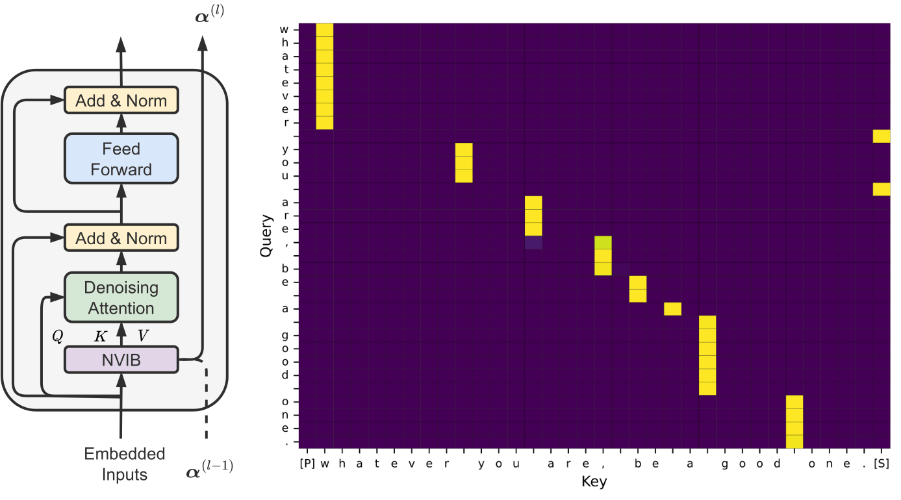
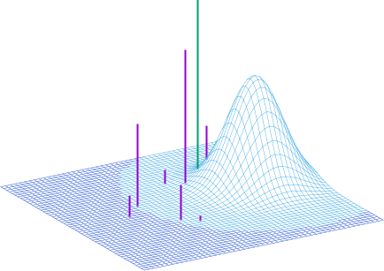

My research interests are in the connections between human cognition and deep learning. Specifically, understanding the connection between deep attention-based models and Bayesian nonparametrics for Natural Language Processing. You can find my papers on [Google Scholar](https://scholar.google.com/citations?hl=en&user=WaZWY0wAAAAJ).

## 2024

|  | [**Nonparametric Variational Regularisation of Pretrained Transformers**](https://arxiv.org/pdf/2312.00662.pdf)   **F. Fehr**,  J. Henderson   **COLM, 2024**.   ([Paper](https://openreview.net/forum?id=Zu8OWNUC0u#discussion)) ([Poster](https://FJFehr.github.io/files/NV_regularisation_poster.pdf)) ([Code](https://github.com/idiap/nvr_transformers)) |

## 2023

|  | [**Nonparametric Variational Regularisation of Pretrained Transformers**](https://arxiv.org/pdf/2312.00662.pdf)   **F. Fehr**,  J. Henderson   **ArXiv, 2023**.   ([Paper](https://arxiv.org/pdf/2312.00662.pdf)) |

|  | [**Learning to Abstract with Nonparametric Variational Information Bottleneck**](https://openreview.net/pdf?id=vU0KbvQ91x)     M. Behjati, **F. Fehr**,  J. Henderson   **EMNLP, 2023**   ([Paper](https://openreview.net/pdf?id=vU0KbvQ91x)) ([Demo](https://huggingface.co/spaces/FJFehr/NVIB-Self-Attention-Demo)) ([Poster](https://FJFehr.github.io/files/NVIB_SA_poster.pdf)) ([Code](https://github.com/idiap/nvib_selfattention)) |

|  | [**HyperMixer: An MLP-based Low Cost Alternative to Transformers**](https://arxiv.org/abs/2203.03691)   F. Mai, A. Pannatier, **F. Fehr**, H. Chen, F. Marelli, F. Fleuret, J. Henderson   **ACL, 2023**   ([Paper](https://arxiv.org/pdf/2203.03691.pdf)) ([Poster](https://FJFehr.github.io/files/Hypermixer_Poster.pdf)) ([Code](https://github.com/idiap/hypermixing))|

|  | [**A Variational AutoEncoder for Transformers with Nonparametric Variational Information Bottleneck**](https://openreview.net/forum?id=6QkjC_cs03X),   J. Henderson, **F. Fehr**   **ICLR, 2023**   ([Paper](https://openreview.net/forum?id=6QkjC_cs03X)) ([Poster](https://FJFehr.github.io/files/NVIB_Poster.pdf)) ([Code](https://github.com/idiap/nvib)) |

## 2022

|  | [**A Variational AutoEncoder for Transformers with Nonparametric Variational Information Bottleneck**](https://arxiv.org/abs/2207.13529),   J. Henderson, **F. Fehr**   **Arxiv, 2022**   ([Paper](https://arxiv.org/pdf/2207.13529.pdf)) |

|  | [**HyperMixer: An MLP-based Green AI Alternative to Transformers**](https://arxiv.org/abs/2203.03691),   F. Mai, A. Pannatier, **F. Fehr**, H. Chen, F. Marelli, F. Fleuret, J. Henderson.   **Arxiv, 2022**   ([Paper](https://arxiv.org/pdf/2203.03691.pdf)) |

## 2020

|  | [**Modelling non-linearity in 3D shapes: A comparative study of Gaussian process morphable models and variational autoencoders for 3D shape data**](https://open.uct.ac.za/handle/11427/35725),  **F. Fehr**   **OpenUCT MSc Thesis, 2020**   ([Paper](https://open.uct.ac.za/bitstream/handle/11427/35725/thesis_sci_2021_fehr%20fabio.pdf?sequence=1&isAllowed=y)) |

## 2018

|  | [**Text Content Classification on News Articles**](https://FJFehr.github.io/files/honours_thesis_FHRFAB001_STRSEA001.pdf),  **F. Fehr** S. Soutar   **UCT BBusSc Thesis, 2018**.   ([Paper](https://FJFehr.github.io/files/honours_thesis_FHRFAB001_STRSEA001.pdf)) |

